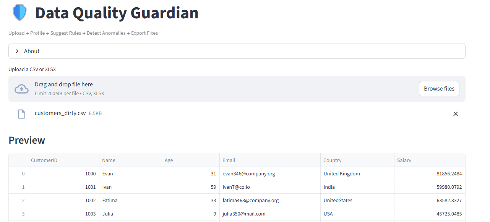
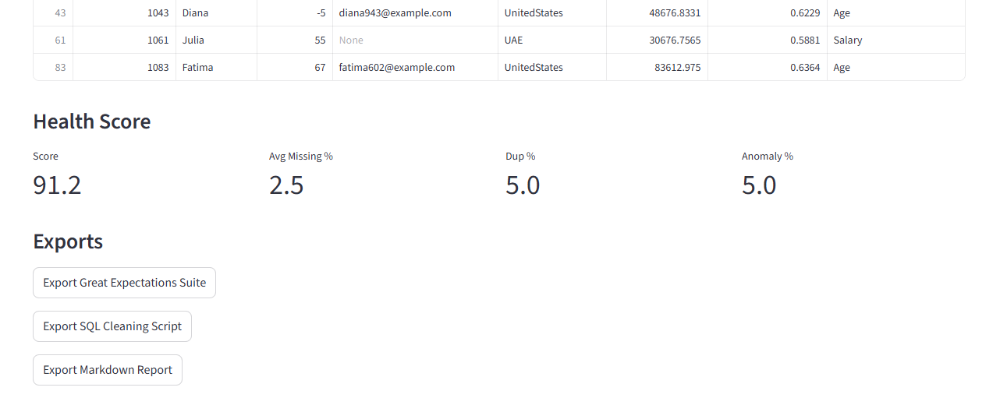

# Data Quality Guardian (DQG)

A beginner-friendly, production-leaning **data quality assistant** for Data Engineers.

**What it does**  
- Upload a CSV/XLSX → get an instant **data health check** (missing %, types, uniques, ranges).
- **Auto-suggest** validation rules (not-null, ranges, allowed values, dedup keys).
- **Detect anomalies** using IsolationForest (numeric) + rare-category detection (categorical).
- **Export**: Great Expectations suite, SQL cleaning script, and a markdown report.

**Tech**: Streamlit, Pandas, scikit-learn, Great Expectations, ydata-profiling (optional).

---

## Quickstart

```bash
# 1) Create & activate a virtual env (example: venv)
python -m venv .venv
# Windows:
.venv\Scripts\activate
# macOS/Linux:
source .venv/bin/activate

# 2) Install deps
pip install -r requirements.txt

# 3) Run the app
streamlit run app.py
```

Open your browser at the URL Streamlit prints (usually http://localhost:8501).

---

## Repo Layout
```
data-quality-guardian/
  app.py
  dqg/
    __init__.py
    profiling.py
    rules.py
    model.py
    fixes.py
    exporters.py
    utils.py
  tests/
    test_rules.py
    test_model.py
  examples/
    customers_dirty.csv
  exports/           # generated artifacts
  requirements.txt
  .gitignore
  README.md
```

---

## Learning checkpoints
- **Milestone 1**: Upload → profile. Understand missingness, types, uniques, ranges.
- **Milestone 2**: Rule suggestion → accept/reject. Learn data validation concepts.
- **Milestone 3**: Anomaly detection → IsolationForest intuition.
- **Milestone 4**: Export GE suite, SQL cleaning, markdown report.

---

## License
MIT